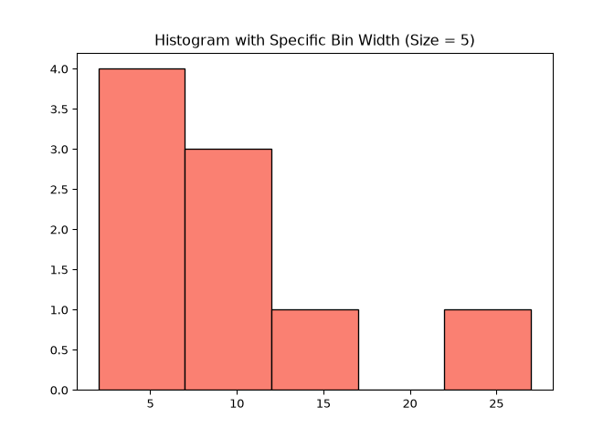

HW01
================
Jonathan Morris
2026-09-25

## Load Packages

``` python
import numpy as np
import pandas as pd
import matplotlib.pyplot as plt
```

# Question 7:

## (a) Read the CSV with ID as text. Preserve the severity order Mild \< Moderate \< Severe. Print the dataset dimensions, duplicate-ID count, missing-wait count, and negative-wait count. (2 points)

``` python
## Read data:
d = pd.read_csv("homework1_clinic.csv", dtype={"id": "string"}) 

## Preserve severity order:
ordered_levels = ["Mild", "Moderate", "Severe"]
d["severity"] = pd.Categorical(d["severity"], categories = ordered_levels, ordered = True)
d_sorted = d.sort_values(by = "severity")
print(d_sorted)
```

    ##     id program  severity  age_years  prior_visits  wait_min  improved
    ## 0   01     Yes      Mild         23             0       2.0         1
    ## 6   07      No      Mild         25             0      10.0         0
    ## 7   08      No      Mild         37             1      10.0         1
    ## 1   02     Yes  Moderate         31             1       4.0         1
    ## 3   04     Yes  Moderate         29             2       6.0         1
    ## 8   09      No  Moderate         43             2      12.0         0
    ## 9   10      No  Moderate         66             5      25.0         0
    ## 2   03     Yes    Severe         45             3       4.0         0
    ## 4   05     Yes    Severe         60             4       8.0         0
    ## 5   06     Yes    Severe         52             2       NaN         1
    ## 10  11      No    Severe         48             2       NaN         1
    ## 11  12      No    Severe         57             3       NaN         0

``` python
## Print data shape:
print(d.shape) 
```

    ## (12, 7)

``` python
## Print duplicated ID's:
duplicated_id = d['id'].duplicated().sum()
print(duplicated_id)
```

    ## 0

``` python
## Print duplicated waits:
duplicated_wait = d['wait_min'].duplicated().sum()
print(duplicated_wait)
```

    ## 4

``` python
## Print negative waits:
negative_wait = (d['wait_min'] < 0).sum()
print(negative_wait)
```

    ## 0

## (b) For observed waits, report n, mean, median, sample variance and SD, Q1, Q3, IQR, fences, and flagged values. Use ddof=1 and NumPy quantile method=“linear”. Compare the overlapping results with your hand calculations in Question 4. (3 points)

``` python
# Print n:
print(d["wait_min"].size)
```

    ## 12

``` python
# Print the mean:
print(np.mean(d["wait_min"]))
```

    ## 9.0

``` python
# Print the variance:
print(np.var(d["wait_min"], ddof = 1))
```

    ## 47.0

``` python
# Print the variance:
print(np.std(d["wait_min"], ddof = 1))
```

    ## 6.855654600401044

``` python
# Print the quartiles:
print(np.nanquantile(d["wait_min"], [0.25, 0.5, 0.75], method = "linear"))
```

    ## [ 4.  8. 10.]

``` python
## Find the IQR and fences:
q1 = np.nanquantile(d["wait_min"], [0.25], method = "linear")
q3 = np.nanquantile(d["wait_min"], [0.75], method = "linear")
iqr = q3 - q1
fence1 = q1 - 1.5*iqr
fence2 = q3 + 1.5*iqr

# Print the flagged values:
flagged = []
for i in d["wait_min"]:
  if i > fence2 or i < fence1:
    flagged.append(i)

print(flagged)
```

    ## [25.0]

The results are …. compared to Q4!!

## (c) Produce a labeled histogram using edges 0, 5, 10, 15, 20, 25, 30, and print the bin counts. Use bins closed on the left and open on the right, except the final bin includes 30. Also produce a labeled horizontal boxplot with the 1.5 × IQR rule. (3 points)

``` python
bin_width = 5
custom_bins = np.arange(min(d["wait_min"]), max(d["wait_min"]) + bin_width, bin_width)

plt.hist(d["wait_min"], bins=custom_bins, edgecolor='black', color='salmon')
plt.title("Histogram with Specific Bin Width (Size = 5)")
plt.show()
```



## (d) In two or three sentences, describe the distribution, explain why the mean uses the observed-wait count, and state how you would handle the flagged wait. (2 points)
