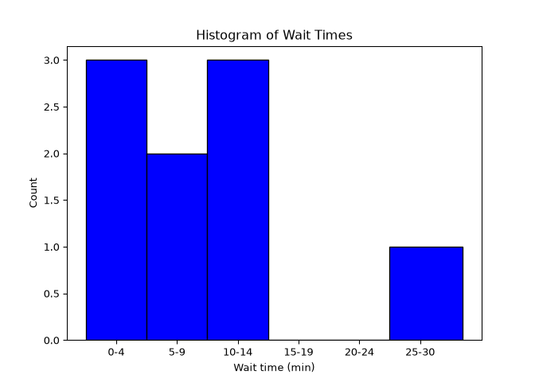
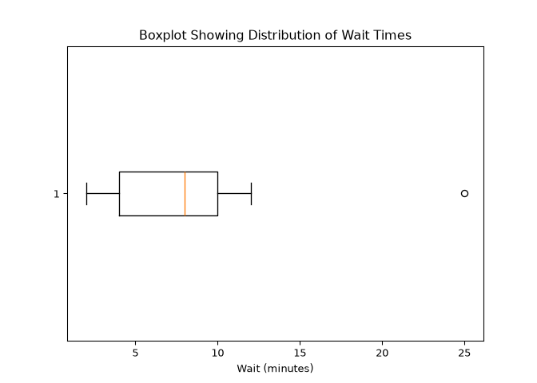
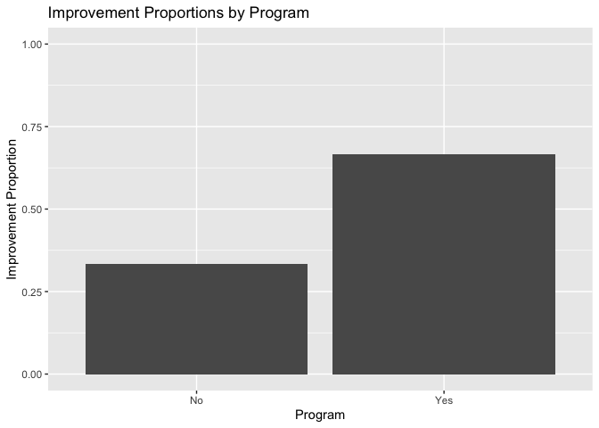

HW01
================
Jonathan Morris
2026-09-25

## Load Packages

``` python
import numpy as np
import pandas as pd
import matplotlib.pyplot as plt
from collections import Counter
```

``` r
library(dplyr)
```

    ## 
    ## Attaching package: 'dplyr'

    ## The following objects are masked from 'package:stats':
    ## 
    ##     filter, lag

    ## The following objects are masked from 'package:base':
    ## 
    ##     intersect, setdiff, setequal, union

``` r
library(tidyverse)
```

    ## ── Attaching core tidyverse packages ──────────────────────── tidyverse 2.0.0 ──
    ## ✔ forcats   1.0.0     ✔ readr     2.1.5
    ## ✔ ggplot2   3.5.2     ✔ stringr   1.5.1
    ## ✔ lubridate 1.9.4     ✔ tibble    3.3.0
    ## ✔ purrr     1.2.0     ✔ tidyr     1.3.1

    ## ── Conflicts ────────────────────────────────────────── tidyverse_conflicts() ──
    ## ✖ dplyr::filter() masks stats::filter()
    ## ✖ dplyr::lag()    masks stats::lag()
    ## ℹ Use the conflicted package (<http://conflicted.r-lib.org/>) to force all conflicts to become errors

# Question 7:

## (a) Read the CSV with ID as text. Preserve the severity order Mild \< Moderate \< Severe. Print the dataset dimensions, duplicate-ID count, missing-wait count, and negative-wait count. (2 points)

``` python
## Read data:
d = pd.read_csv("homework1_clinic.csv", dtype={"id": "string"}) 

## Preserve severity order:
ordered_levels = ["Mild", "Moderate", "Severe"]
d["severity"] = pd.Categorical(d["severity"], categories = ordered_levels, ordered = True)
d_sorted = d.sort_values(by = "severity")
print(d_sorted)
```

    ##     id program  severity  age_years  prior_visits  wait_min  improved
    ## 0   01     Yes      Mild         23             0       2.0         1
    ## 6   07      No      Mild         25             0      10.0         0
    ## 7   08      No      Mild         37             1      10.0         1
    ## 1   02     Yes  Moderate         31             1       4.0         1
    ## 3   04     Yes  Moderate         29             2       6.0         1
    ## 8   09      No  Moderate         43             2      12.0         0
    ## 9   10      No  Moderate         66             5      25.0         0
    ## 2   03     Yes    Severe         45             3       4.0         0
    ## 4   05     Yes    Severe         60             4       8.0         0
    ## 5   06     Yes    Severe         52             2       NaN         1
    ## 10  11      No    Severe         48             2       NaN         1
    ## 11  12      No    Severe         57             3       NaN         0

``` python
## Print data shape:
print(d.shape) 
```

    ## (12, 7)

``` python
## Print duplicated ID's:
duplicated_id = d['id'].duplicated().sum()
print(duplicated_id)
```

    ## 0

``` python
## Print duplicated waits:
duplicated_wait = d['wait_min'].duplicated().sum()
print(duplicated_wait)
```

    ## 4

``` python
## Print negative waits:
negative_wait = (d['wait_min'] < 0).sum()
print(negative_wait)
```

    ## 0

## (b) For observed waits, report n, mean, median, sample variance and SD, Q1, Q3, IQR, fences, and flagged values. Use ddof=1 and NumPy quantile method=“linear”. Compare the overlapping results with your hand calculations in Question 4. (3 points)

``` python
# Print n:
print(d["wait_min"].size)
```

    ## 12

``` python
# Print the mean:
print(np.mean(d["wait_min"]))
```

    ## 9.0

``` python
# Print the variance:
print(np.var(d["wait_min"], ddof = 1))
```

    ## 47.0

``` python
# Print the variance:
print(np.std(d["wait_min"], ddof = 1))
```

    ## 6.855654600401044

``` python
# Print the quartiles:
print(np.nanquantile(d["wait_min"], [0.25, 0.5, 0.75], method = "linear"))
```

    ## [ 4.  8. 10.]

``` python
## Find the IQR and fences:
q1 = np.nanquantile(d["wait_min"], [0.25], method = "linear")
q3 = np.nanquantile(d["wait_min"], [0.75], method = "linear")
iqr = q3 - q1
fence1 = q1 - 1.5*iqr
fence2 = q3 + 1.5*iqr

# Print the flagged values:
flagged = []
for i in d["wait_min"]:
  if i > fence2 or i < fence1:
    flagged.append(i)

print(flagged)
```

    ## [25.0]

The results are …. compared to Q4!!

## (c) Produce a labeled histogram using edges 0, 5, 10, 15, 20, 25, 30, and print the bin counts. Use bins closed on the left and open on the right, except the final bin includes 30. Also produce a labeled horizontal boxplot with the 1.5 × IQR rule. (3 points)

### Create Histogram:

``` python
custom_bins = np.array([0, 5, 10, 15, 20, 25, 31])

plt.hist(d["wait_min"], bins=custom_bins, edgecolor='black', color='blue')

# Add tick labels:
centers = custom_bins[:-1] + 2.5 # Label bin centers except for the upper bound.
labels = [f"{b}-{b+4}" for b in custom_bins[:-1]] # Create a list of bin labels.
labels[-1] = "25-30" # Add a last label for the final bin.
plt.xticks(centers, labels) # Add the labels to the plot.
```

    ## ([<matplotlib.axis.XTick object at 0x12a465e80>, <matplotlib.axis.XTick object at 0x12a4a4910>, <matplotlib.axis.XTick object at 0x12a4a5090>, <matplotlib.axis.XTick object at 0x12a4a5810>, <matplotlib.axis.XTick object at 0x12a4a5f90>, <matplotlib.axis.XTick object at 0x12a4a6710>], [Text(2.5, 0, '0-4'), Text(7.5, 0, '5-9'), Text(12.5, 0, '10-14'), Text(17.5, 0, '15-19'), Text(22.5, 0, '20-24'), Text(27.5, 0, '25-30')])

``` python
plt.title("Histogram with Specific Bin Width (Size = 5)")
plt.xlabel("Wait time (min)")
plt.ylabel("Count")
plt.show()
```



### Create Boxplot:

``` python
plt.boxplot(d["wait_min"].dropna(), orientation="horizontal",
whis=1.5, showmeans=False)
```

    ## {'whiskers': [<matplotlib.lines.Line2D object at 0x12bb33d90>, <matplotlib.lines.Line2D object at 0x12bb33ed0>], 'caps': [<matplotlib.lines.Line2D object at 0x12bb50050>, <matplotlib.lines.Line2D object at 0x12bb50190>], 'boxes': [<matplotlib.lines.Line2D object at 0x12bb33c50>], 'medians': [<matplotlib.lines.Line2D object at 0x12bb502d0>], 'fliers': [<matplotlib.lines.Line2D object at 0x12bb50410>], 'means': []}

``` python
plt.title("Boxplot Showing Distribution of Wait Times")
plt.xlabel("Wait (minutes)")
plt.show()
```



## (d) In two or three sentences, describe the distribution, explain why the mean uses the observed-wait count, and state how you would handle the flagged wait. (2 points)

The mean uses the observed wait count in the basic formula for sample
mean by dividing the sum of all the observations by the number of non-na
values (i.e., the observed wait count). In this case, since the flagged
wait is so much higher than other waits, I would run analyses with and
without the outlier to see if results changed. If I were presenting or
writing a paper, I would report both results.

# Question 8 An observational comparison in R

## a. Read the same CSV. Print the program-by-improved count table. For each program group, report total participants, observed improvement outcomes, number improved, improvement proportion, and number of missing waits. Do not exclude an observed improvement outcome because its waiting time is missing. (3 points)

``` r
# Load the data:
d <- read_csv("homework1_clinic.csv")
```

    ## Rows: 12 Columns: 7
    ## ── Column specification ────────────────────────────────────────────────────────
    ## Delimiter: ","
    ## chr (3): id, program, severity
    ## dbl (4): age_years, prior_visits, wait_min, improved
    ## 
    ## ℹ Use `spec()` to retrieve the full column specification for this data.
    ## ℹ Specify the column types or set `show_col_types = FALSE` to quiet this message.

``` r
# Report total participants:
total_pp = d |> 
  filter(!is.na(id)) |> 
  count()

paste0("We have ", total_pp, " unique participants.")
```

    ## [1] "We have 12 unique participants."

``` r
# Report observed improvement outcomes:
improved_obs = d |> 
  filter(!is.na(improved)) |> 
  count() |> 
  pull()

paste0("We have ", improved_obs, " observed improvement outcomes.")
```

    ## [1] "We have 12 observed improvement outcomes."

``` r
# Report number improved:
improved_count = d |> 
  filter(improved == 1) |> 
  count() |> 
  pull()

paste0("We have ", improved_count, " particpants that improved.")
```

    ## [1] "We have 6 particpants that improved."

``` r
# Report improvement proportion:
improved_proportion = improved_count / improved_obs 

paste0("Our improvement proportion is: ", improved_proportion)
```

    ## [1] "Our improvement proportion is: 0.5"

``` r
# Report number of missing waits:
missing_waits = d |> 
  filter(is.na(wait_min)) |> 
  count() |> 
  pull()

paste0("We have ", missing_waits, " missing wait times.")
```

    ## [1] "We have 3 missing wait times."

## b. Calculate the Yes-minus-No difference in improvement proportions. Express it as both a proportion difference and percentage points. (2 points)

``` r
# Calculate yes count:
improved_yes_c = d |> 
  filter(program == "Yes", improved == 1) |> 
  count() |> 
  pull()

# Calculate no count:
improved_no_c = d |> 
  filter(program == "No", improved == 1) |> 
  count() |> 
  pull()

# Calculate ratios:
yes_ratio = improved_yes_c / d |> filter(program == "Yes") |> count() |> pull()
no_ratio = improved_no_c / d |> filter(program == "No") |> count() |> pull()

# Calculate difference:
paste0("The yes-no difference is: ", yes_ratio - no_ratio, ".")
```

    ## [1] "The yes-no difference is: 0.333333333333333."

## c. Make a labeled bar chart of the two improvement proportions with a vertical axis from 0 to 1. (1 point)

``` r
# Make a data frame with the proportions:
df = tibble(
  program = c("Yes", "No"),
  ratio = c(yes_ratio, no_ratio)
)

df |> 
  ggplot(aes(x = program, y = ratio)) +
  geom_col() +
  ylim(0, 1) + 
  xlab("Program") +
  ylab("Improvement Proportion") +
  ggtitle("Improvement Proportions by Program")
```

<!-- -->

## d. Write a defensible interpretation limited to these participants. Explain why the difference is not automatically a causal effect, naming one plausible baseline confounder and how it could affect both program choice and improvement. (2 points)

Based on these results, we can conclude that in this sample of 12
participants, those that chose counseling had almost double the
improvement ratio when compared to those students that did not chose
counseling. This is not necessarily a causal effect because participants
were not randomized and self-selected into groups. One possible
confounder is self-selection bias where participants who were more
likely to benefit from counseling could have selected into counseling
programs, therefore biasing the outcomes in number of participants that
improved.

# Question 9 Checking diagnostic probabilities in Python

# In a hypothetical population, disease prevalence is 0.02, sensitivity is 0.90, and specificity is 0.95. Let D mean disease and T mean a positive test. Assume independent simulated people and the stated conditional test probabilities.

## a. Use np.random.default_rng(813109) and B=100000. First generate B independent uniforms to assign disease; then generate B new independent uniforms to assign positive tests with probability 0.90 for people with disease and 0.05 otherwise. Print the four counts TP, FN, FP, and TN, with clear labels. (3 points)

``` python
rng = np.random.default_rng(813109)
B = 100000

# Create disease vector
D = rng.random(B) < 0.02

# Create test vector:
p_pos = np.where(D, 0.90, 0.05) # Creates an array which assigns 0.90 to any row with TRUE in D and 0.05 to FALSE, etc.
T = rng.random(B) < p_pos

# Calculate counts:
TP = np.sum(D & T)
FN = np.sum(D & ~T)
FP = np.sum(~D & T)
TN = np.sum(~D & ~T)

print(f"True positives  (TP): {TP}")
```

    ## True positives  (TP): 1766

``` python
print(f"False negatives (FN): {FN}")
```

    ## False negatives (FN): 206

``` python
print(f"False positives (FP): {FP}")
```

    ## False positives (FP): 4913

``` python
print(f"True negatives  (TN): {TN}")
```

    ## True negatives  (TN): 93115

## b. Calculate empirical sensitivity, specificity, PPV, and NPV from their appropriate subsets. Compute the corresponding theoretical probabilities using the given model and compare theory with simulation. Briefly explain any differences; simulation is an empirical check rather than a mathematical proof. (3 points)

``` python
# Calculate sensitivity, the proportion of people that test positive given that they have the disease:
sensitivity = TP/(TP + FN)
print("The sensitivity is: ",sensitivity)
```

    ## The sensitivity is:  0.8955375253549696

``` python
# Calculate specificity, the proportion of people that test negative given that they do not have the disease:
specificity = TN/(TN + FP)
print("The specificity is: ", specificity)
```

    ## The specificity is:  0.9498816664626434

``` python
# Calculate positive predictive value, the proportion of people that actually have the disease and test positive:
PPV = TP/(TP + FP)
print("The PPV is: ", PPV)
```

    ## The PPV is:  0.2644108399460997

``` python
# Calculate negative predictive value, the proportion of people that test negative and do not have the disease:
NPV = TN/(TN + FN)
print("The NPV is: ", NPV)
```

    ## The NPV is:  0.9977925654461482

The results closely resemble what we would expect from a theoretical
calculation, with only slight differences in the computed sensitivity
and specificity values. These differences are largely accounted for when
we round to the second decimal place, but demonstrate that the
simulation will still have slight discrepancies when compared to the
theoretical case. As B goes to infinity, our theoretical and simulated
results will get closer and closer. This does not demonstrate a
mathematical proof because we only simulated the results in a heuristic
example. To prove these relationships, we would need to show that as B
goes to infinity, the simulated result converges to the theoretical
result.

## c. Holding sensitivity and specificity fixed, calculate the theoretical PPV when prevalence rises to 0.20. Explain the direction of the change. (2 points)

The PPV rises to 0.82 (see notes). This is likely due to the fact that
as the prevalence rises, we expect more people in the population to have
the disease, hence it is also much more likely that someone who tests
positive will have the disease also.

# Question 10 Sampling without replacement in R

# A group contains eight distinct people labeled 1–8; people 1–3 have a specified allergy. In one trial, select three people uniformly without replacement. The event of interest is that all three selected people have the allergy. Reset the full eight-person population before the next trial.

## a. State the exact event probability as a product of conditional probabilities. Also calculate the corresponding probability for three independent draws with replacement. (2 points)

## b. Use B=100000 and set.seed(813110) to simulate groups with sample.int(8, 3, replace=FALSE). Then use set.seed(813111) and replace=TRUE for the second model. Report successes, empirical probabilities, and theoretical probabilities for both models. (3 points)

``` r
B = 10000
set.seed(813110)
# Run the first model without replacement:
m1 <- replicate(B, all(sample.int(8, 3, replace = FALSE) <= 3))
succ1 <- sum(m1)
emp1  <- mean(m1)
theo1 <- (3/8) * (2/7) * (1/6)

paste0("Successes for model 1: ", sum(m1 <= 3))
```

    ## [1] "Successes for model 1: 10000"

``` r
paste0("Probability of ", sum(m1 <= 3),
       " successes in model 1: P(X = 0) = $\\frac{5}{8} \\frac{4}{8} \\frac{3}{8}$")
```

    ## [1] "Probability of 10000 successes in model 1: P(X = 0) = $\\frac{5}{8} \\frac{4}{8} \\frac{3}{8}$"

``` r
set.seed(813111)
# Run the second model with replacement:
m2 <- replicate(B, all(sample.int(8, 3, replace = TRUE) <= 3))
succ2 <- sum(m2)
emp2  <- mean(m2)
theo2 <- (3/8)^3
paste0("Successes for model 2: ", sum(m2 <= 3))
```

    ## [1] "Successes for model 2: 10000"

## c. For the simulation without replacement, report running empirical probabilities after 100, 1,000, 10,000, and 100,000 trials. Plot the running probability against the number of trials, with a horizontal line at the theoretical probability. A logarithmic horizontal axis is acceptable. (3 points)

## d. Explain why the two models have different probabilities. Does the law of large numbers guarantee exact agreement after 25 trials, or that each additional trial moves the estimate closer to the truth? (2 points)
